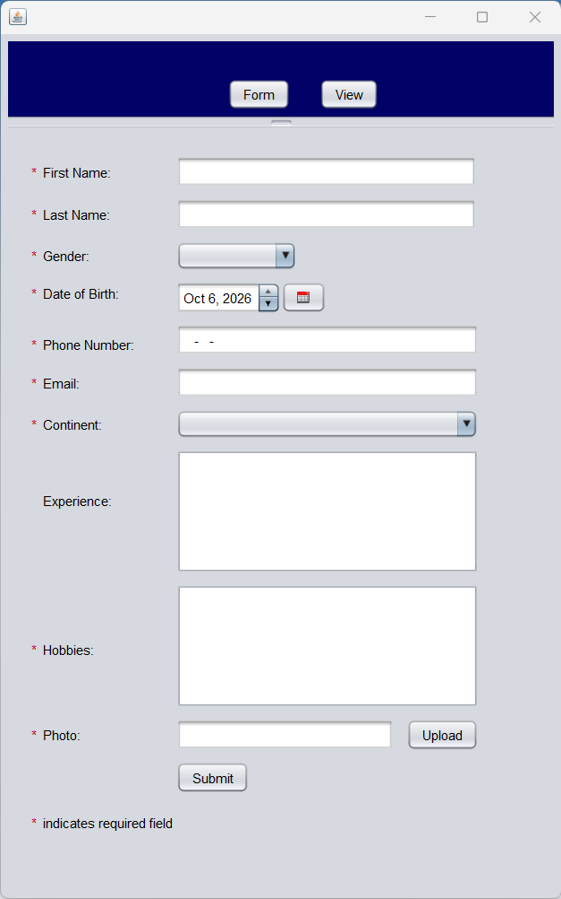
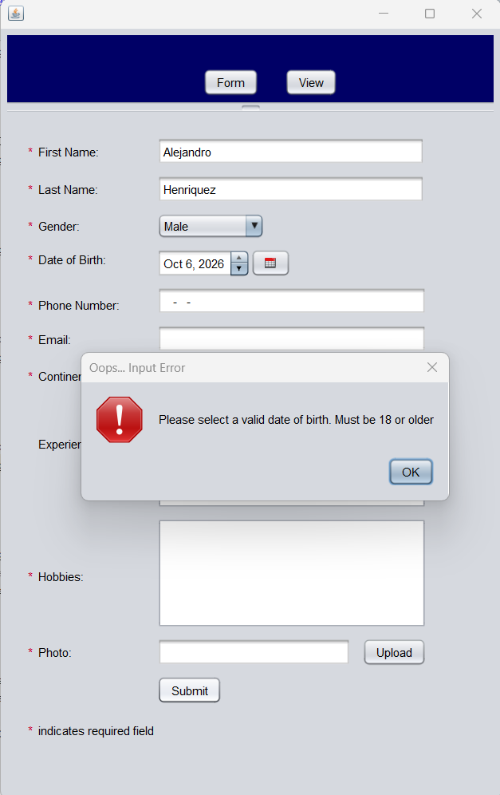
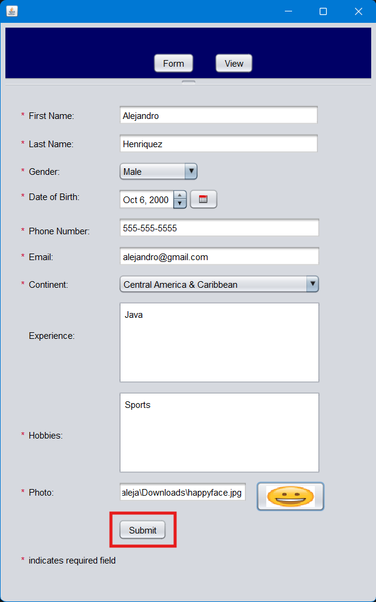
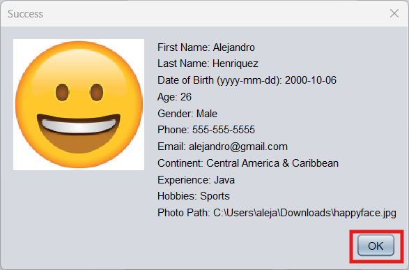
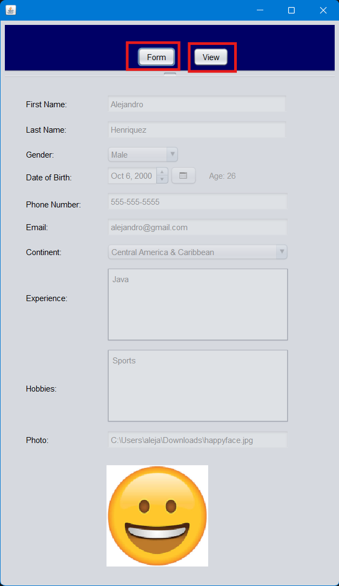

# INFO 5100 Application Engineering and Development

A Java Swing desktop application built incrementally across the labs of INFO 5100 at Northeastern University Toronto. Each lab adds features to the same project, and every lab is tagged in Git so its exact state can be reviewed at any time.

**Author:** Alejandro Henriquez

## Labs

| Lab | What was built | Git tag |
|---|---|---|
| Lab 3 | Single-window user input form with validation, photo upload, and a success dialog | [`lab3`](https://github.com/alehenz/info5100-lab/tree/lab3) |
| Lab 4 | Split-pane navigation with CardLayout, separate registration and view panels, full validation, and a date picker | [`lab4`](https://github.com/alehenz/info5100-lab/tree/lab4) |

To see the code exactly as it was for a given lab:

```bash
git checkout lab3    # or lab4
git checkout main    # return to the latest version
```

## Requirements

- JDK and Apache NetBeans (developed with NetBeans 16)
- No other setup. The date picker library is bundled in `lib/` and referenced by a relative path.

## How to run

1. Clone the repository:
   ```bash
   git clone https://github.com/alehenz/info5100-lab.git
   ```
2. In NetBeans, choose **File > Open Project** and select the cloned folder.
3. Right-click `src/ui/MainJFrame.java` and choose **Run File** (Shift+F6).

## Project structure

```
info5100-lab/
|-- lib/
|   `-- jcalendar-0.8.jar          Date picker library
|-- nbproject/                     NetBeans project configuration
|-- screenshots/                   Application screenshots, grouped by lab
|-- src/
|   |-- model/
|   |   `-- User.java              Data model
|   `-- ui/
|       |-- MainJFrame.java        Main window: split pane and navigation
|       |-- RegistrationJPanel.java  Registration form and validation
|       `-- ViewJPanel.java        Read-only details screen
|-- build.xml
`-- README.md
```

## Lab 4: Registration and view panels

### How it works

- `MainJFrame` contains a `JSplitPane`. The top section holds the **Form** and **View** navigation buttons. The bottom section is a panel using `CardLayout` that holds the two screens.
- `RegistrationJPanel` collects the user's details and validates every field. On a valid submission it builds a `User` object, passes it to `ViewJPanel.displayUser(...)`, and switches the card to the view screen.
- `ViewJPanel` displays the `User` with every input disabled, including the date of birth, the calculated age, and the uploaded photo.
- `User` is the model that carries the data between the two panels.

### Fields and validation

| Field | Rule |
|---|---|
| First name, last name | Required. Letters, spaces, hyphens, and apostrophes only |
| Gender | Required (dropdown) |
| Date of birth | Chosen with the calendar picker. The user must be 18 or older, and age is calculated from this date |
| Phone number | Required. Format `123-456-7890`, enforced by an input mask |
| Email | Required. Must be a valid address, for example `name@example.com` |
| Continent | Required (dropdown) |
| Experience | Optional |
| Hobbies | Required |
| Photo | Required. Must be a readable image file |

Each failed check shows an error message describing the problem, and the form stays open until every field is valid.

### Screenshots

**1. Empty form.** Gender and continent start unselected.



**2. Validation error.** An error message appears when a field is invalid.



**3. Filled form.** All required fields completed, with a photo uploaded.



**4. Success dialog.** Shown after a valid submission.



**5. View screen.** The submitted details with all inputs disabled, plus the age and photo.



## Lab 3: User input form

The first version was a single-window form (`UserJFrame`) with the same kind of validation, a photo upload, and a dialog that displayed the submitted details. That version is preserved at the `lab3` tag. Its screenshots are in the `screenshots/` folder.


## Design notes and assumptions

- A user must be at least 18 years old.
- Age is derived from the date of birth and stored in the model alongside it.
- Photos are scaled to 150 by 150 pixels on the view screen.
- The view screen is read-only. It reflects the most recent valid submission.
