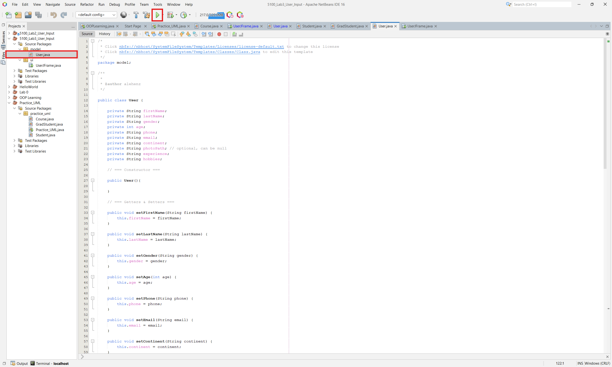
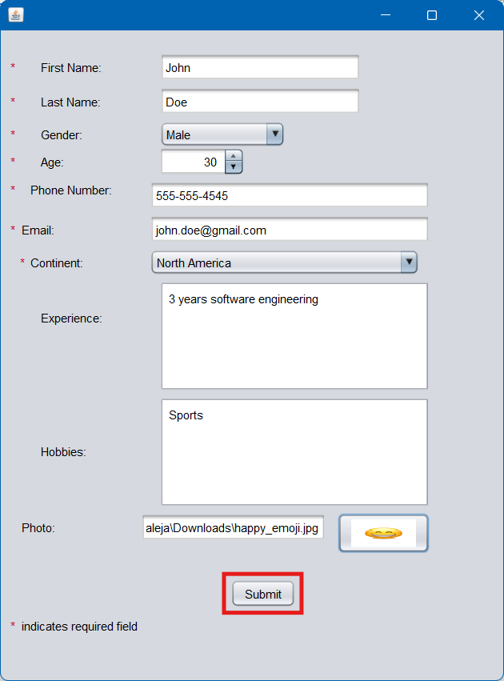
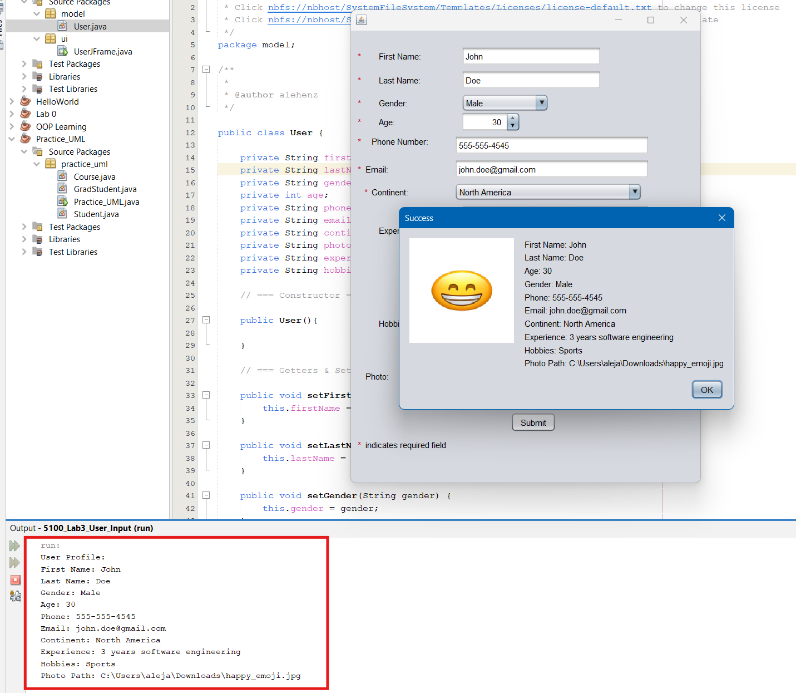

# Lab 3 – User Input Form (INFO 5100)

## Description
A Java Swing application that collects a user profile (name, gender, age, phone, email, continent, experience, hobbies, and an optional photo), validates all required fields, and displays the submitted profile in a confirmation dialog.

## How to Run
1. Open the project in NetBeans.
2. Run `UserJFrame.java`.
3. Fill in the required fields (marked with `*`).
4. Optionally upload a photo.
5. Click **Submit**.

## Screenshots

### 1. Running the program

### 2. Filling out the form

### 3. Submission result
Success dialog displaying the submitted profile, with the created `User` object's attributes also printed to the console via `toString()`.
